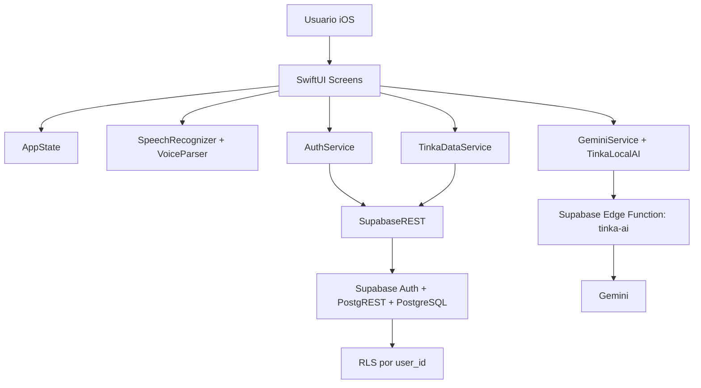

# Tinka

## Documentación para presentación de hackathon

**Tinka** es una aplicación iOS para pequeños negocios que convierte ventas diarias, catálogo de productos y comandos de voz en información útil para tomar mejores decisiones. La app está pensada para vendedores, caseritas, emprendimientos de comida, tiendas pequeñas y negocios que necesitan registrar ventas rápido sin depender de sistemas complejos.

La idea central es simple: el usuario habla o registra una venta, Tinka organiza los datos, calcula métricas, protege la información por cuenta y entrega recomendaciones de negocio con IA.

---

## Resumen ejecutivo

Tinka ayuda a micro y pequeños negocios a digitalizar su operación diaria desde el celular.

El usuario puede:

- Crear una cuenta e iniciar sesión con Supabase Auth.
- Configurar su perfil de negocio.
- Crear productos y combos.
- Registrar ventas manualmente o por voz.
- Consultar dashboard, métricas y reportes.
- Exportar reportes en PDF.
- Recibir sugerencias inteligentes con IA.
- Mantener sus datos aislados por usuario con Supabase RLS.

Para una demo de hackathon, Tinka muestra cómo una experiencia móvil sencilla puede unir **voz, IA, analítica y backend seguro** para resolver un problema real de digitalización.

---

## Problema

Muchos pequeños negocios todavía registran ventas en papel, memoria o mensajes sueltos. Esto provoca:

- Pérdida de información.
- Dificultad para saber cuánto se vendió realmente.
- Cero claridad sobre productos más vendidos.
- Poca capacidad para tomar decisiones de precio, combos o promociones.
- Barreras tecnológicas para usuarios que no quieren llenar formularios largos.

Además, herramientas tradicionales de punto de venta suelen ser demasiado complejas para negocios pequeños o informales.

---

## Solución

Tinka propone una app ligera, visual y asistida por voz que permite registrar y analizar ventas en segundos.

La app combina:

- **SwiftUI** para una experiencia móvil nativa.
- **Supabase REST** para autenticación, base de datos y seguridad.
- **Speech Framework** para reconocimiento de voz.
- **Parser local fuzzy** para entender nombres de productos aunque se pronuncien distinto.
- **Gemini vía Supabase Edge Function** como capa de inteligencia remota.
- **IA local de respaldo** para que la app siga respondiendo aunque Gemini no esté disponible.
- **PDF export** para compartir reportes.

---

## Público objetivo

Tinka está diseñada para:

- Vendedores de comida.
- Tiendas de barrio.
- Emprendedores pequeños.
- Negocios familiares.
- Usuarios que prefieren hablar antes que llenar formularios.
- Instituciones financieras o programas de apoyo que quieren impulsar digitalización de microempresas.

---

## Propuesta de valor

### Para el usuario

- Registrar ventas rápido.
- Ver cuánto vendió hoy, en la semana y en el mes.
- Saber cuál producto se vende más.
- Crear combos y promociones.
- Tener recomendaciones accionables.
- Exportar reportes.

### Para una institución o ecosistema financiero

- Mayor educación financiera.
- Datos estructurados del negocio.
- Base para futuras recomendaciones de crédito, ahorro o crecimiento.
- Digitalización accesible para microempresas.

---

## Stack técnico

- **Frontend:** SwiftUI.
- **Lenguaje:** Swift.
- **Proyecto:** Xcode iOS.
- **Backend:** Supabase REST.
- **Auth:** Supabase Auth por REST.
- **Base de datos:** PostgreSQL en Supabase.
- **Seguridad:** Row Level Security.
- **Red:** URLSession async/await.
- **Voz:** Apple Speech Framework.
- **IA remota:** Gemini mediante Supabase Edge Function.
- **IA local:** Motor local basado en reglas y métricas del negocio.
- **Exportación:** `UIGraphicsPDFRenderer`.
- **Persistencia auxiliar:** UserDefaults para cache local ligero.

---

## Arquitectura general



---

## Módulos principales

### `RootView`

Controla el estado principal de la app:

- Splash.
- Login.
- App autenticada.
- Navegación por pestañas.
- Carga de datos desde Supabase después del login.

Archivo:

`design-zone/Root/RootView.swift`

### `TinkaTabBar`

Barra inferior con navegación principal:

- Inicio.
- Ventas.
- Voz.
- Catálogo.
- Reportes.
- Perfil.

Archivo:

`design-zone/Root/TinkaTabBar.swift`

### `AuthService`

Maneja autenticación y flujo de registro:

- Login.
- Registro.
- Recuperación de contraseña.
- Manejo amigable de rate limit 429.
- Detección de cuenta existente.
- Creación o actualización de `business_profiles`.
- Soporte para confirmación de email activada o desactivada.

Archivo:

`design-zone/Services/AuthService.swift`

### `SupabaseREST`

Cliente REST propio, sin `supabase-swift SDK`.

Responsabilidades:

- Login por `/auth/v1/token`.
- Registro por `/auth/v1/signup`.
- Password reset por `/auth/v1/recover`.
- CRUD genérico con PostgREST.
- Manejo de sesión.
- Lectura de `user_id` desde JWT.
- Mapeo de errores HTTP.

Archivo:

`design-zone/Services/SupabaseClient.swift`

### `TinkaDataService`

Capa de acceso a datos del negocio:

- Productos.
- Combos.
- Items de combos.
- Ventas.
- Items de ventas.
- Chat.
- Perfil de negocio.

Todas las operaciones filtran por `user_id` para mantener independencia entre usuarios.

Archivo:

`design-zone/Services/TinkaDataService.swift`

### `AppState`

Estado observable central de la app:

- Ventas.
- Productos.
- Combos.
- Mensajes.
- Perfil.
- Métricas calculadas.
- Acciones de agregar, editar, eliminar y sincronizar.

Archivo:

`design-zone/Models/AppState.swift`

---

## Funcionalidades

## 1. Autenticación

Tinka usa Supabase Auth vía REST.

Flujos soportados:

- Iniciar sesión.
- Crear cuenta.
- Recuperar contraseña.
- Manejo de cuenta existente.
- Manejo de rate limit de emails.
- Flujo con confirmación de email activada.
- Flujo de demo con confirmación de email desactivada.

### Manejo de error 429

Cuando Supabase responde:

```json
{
  "error_code": "over_email_send_rate_limit"
}
```

La app muestra:

> Ya solicitaste un registro hace poco. Espera unos segundos e intenta nuevamente.

También evita taps repetidos durante el registro.

---

## 2. Perfil de negocio

Cada usuario puede tener su perfil:

- Nombre del dueño.
- Nombre del negocio.
- Tipo de negocio.
- Ciudad.
- Teléfono.

El perfil se guarda en `business_profiles` y se protege con RLS.

---

## 3. Catálogo de productos

El usuario puede:

- Crear productos.
- Editar productos.
- Eliminar productos.
- Activar o desactivar productos.
- Agregar alias de voz.
- Cargar productos base manualmente.

Las cuentas nuevas empiezan con catálogo vacío. Esto evita que un usuario nuevo herede datos prellenados.

---

## 4. Combos

El usuario puede crear combos a partir de productos activos.

Ejemplo:

- Combo Almuerzo.
- Combo Desayuno.
- Producto + bebida.

Los combos tienen:

- Nombre.
- Productos incluidos.
- Precio final.
- Aliases de voz.

---

## 5. Registro de ventas

Tinka soporta ventas por:

- Registro manual.
- Acciones rápidas.
- Voz.

Cada venta guarda:

- Fecha.
- Productos vendidos.
- Cantidad.
- Precio.
- Total.
- Canal de venta.

---

## 6. Voz

Tinka usa `SpeechRecognizer` con locale español:

- `es-BO`.
- Fallback `es-ES`.

Luego el texto pasa por `VoiceParser`.

El parser soporta:

- Normalización de acentos.
- Remoción de puntuación.
- Plurales.
- Alias de productos.
- Fuzzy matching con Levenshtein.
- Cantidades por número o palabra.
- Reconocimiento de combos.
- Ambigüedad cuando hay múltiples coincidencias.

Ejemplos:

- “vendí una salteña”
- “vendí dos refrescos”
- “vendí un combo almuerzo”
- “vendí tres saltenas”

---

## 7. Dashboard

La pantalla de inicio muestra:

- Saludo personalizado.
- Ventas de hoy.
- Ventas de la semana.
- Utilidad estimada.
- Ticket promedio.
- Producto más vendido.
- Tinka Score.
- Recomendaciones de IA.
- Acciones rápidas.
- Tendencia semanal.

---

## 8. Reportes

Reportes permite consultar:

- Total vendido.
- Cantidad de ventas.
- Ticket promedio.
- Utilidad estimada.
- Productos más vendidos.
- Historial.
- Tendencia semanal.

Además, permite exportar un PDF con resumen del negocio.

---

## 9. IA

Tinka tiene dos capas de inteligencia.

### IA local

Funciona siempre, incluso sin red.

Analiza:

- Ventas de hoy.
- Ventas semanales.
- Producto estrella.
- Score.
- Ticket promedio.
- Estado financiero.
- Catálogo activo.
- Combos activos.

### Gemini vía Edge Function

Cuando está disponible, `GeminiService` llama a:

`https://jhsnshxuxlnwkkbszcjx.supabase.co/functions/v1/tinka-ai`

La llamada envía:

- Mensaje del usuario.
- Contexto del negocio.
- Token de sesión si existe.
- Anon key como `apikey`.

Si Gemini falla, Tinka vuelve al motor local.

---

## Seguridad

Tinka usa Supabase RLS para aislar los datos por usuario.

Tablas protegidas:

- `business_profiles`
- `products`
- `combos`
- `combo_items`
- `sales`
- `sale_items`
- `chat_messages`

La app filtra las operaciones por `user_id`, y el SQL de RLS valida:

```sql
auth.uid() = user_id
```

También se agregó `user_id` a:

- `combo_items`
- `sale_items`

Esto evita que las tablas hijas dependan únicamente del ID del combo o venta.

Archivo SQL:

`supabase/rls_policies.sql`

---

## Modelo de datos

### `business_profiles`

Representa el perfil del negocio.

Campos principales:

- `id`
- `user_id`
- `owner_name`
- `business_name`
- `business_type`
- `city`
- `phone`

### `products`

Catálogo del usuario.

Campos principales:

- `id`
- `user_id`
- `name`
- `price`
- `category`
- `description`
- `emoji`
- `aliases`
- `active`

### `combos`

Combos creados por el usuario.

Campos principales:

- `id`
- `user_id`
- `name`
- `description`
- `price`
- `emoji`
- `aliases`
- `active`

### `combo_items`

Productos incluidos en un combo.

Campos principales:

- `id`
- `user_id`
- `combo_id`
- `product_id`
- `product_name`
- `quantity`

### `sales`

Venta registrada.

Campos principales:

- `id`
- `user_id`
- `source`
- `total`

### `sale_items`

Detalle de cada venta.

Campos principales:

- `id`
- `user_id`
- `sale_id`
- `product_id`
- `combo_id`
- `item_name`
- `quantity`
- `unit_price`
- `subtotal`

### `chat_messages`

Historial de mensajes de IA.

Campos principales:

- `id`
- `user_id`
- `role`
- `content`

---

## Experiencia de usuario

Tinka está diseñada para que el usuario pueda operar sin fricción:

1. Entra a la app.
2. Ve su resumen del día.
3. Usa el micrófono para registrar venta.
4. Confirma productos detectados.
5. Consulta métricas.
6. Recibe sugerencias.
7. Exporta reporte.

El diseño visual usa:

- Identidad Banco Fie.
- Fondo claro en pantallas principales.
- Logo sobre fondo negro en inicio.
- Barra inferior tipo glass.
- Botón central de voz destacado.
- Tarjetas de métricas simples.
- Colores azul, morado y magenta.

---

## Setup para demo

### 1. Supabase Auth

Para hackathon/demo:

Supabase Dashboard -> Authentication -> Providers -> Email -> desactivar **Confirm Email**.

Esto evita rate limits de emails y permite que el registro devuelva sesión inmediatamente.

### 2. RLS

Ejecutar:

`supabase/rls_policies.sql`

en Supabase Dashboard -> SQL Editor.

### 3. Xcode

Abrir:

`design-zone.xcodeproj`

Ejecutar en iPhone Simulator o dispositivo físico.

### 4. Permisos

Para usar voz, aceptar permisos de:

- Micrófono.
- Speech Recognition.

---

## Flujo recomendado de demo

### Demo en 3 minutos

1. Mostrar splash e identidad visual.
2. Registrar o iniciar sesión.
3. Completar perfil del negocio.
4. Ir a Catálogo.
5. Crear productos reales o tocar **Cargar base**.
6. Ir a Voz.
7. Decir: “vendí dos refrescos y una salteña”.
8. Confirmar venta.
9. Volver a Inicio y mostrar actualización del dashboard.
10. Ir a Reportes y exportar PDF.
11. Mostrar IA sugiriendo acciones de negocio.

### Frase para pitch

> Tinka convierte la voz de un pequeño negocio en datos, reportes e inteligencia financiera accionable.

---

## Diferenciadores

- Registro por voz pensado para vendedores reales.
- Parser local con fuzzy matching para nombres bolivianos.
- IA local siempre disponible.
- Gemini como mejora remota, no como dependencia crítica.
- Supabase REST sin SDK, control total del flujo.
- RLS real por usuario.
- Reportes exportables.
- Experiencia visual pensada para demo y uso cotidiano.

---

## Estado actual

Funcional:

- Login.
- Registro.
- Recuperación de contraseña.
- Supabase REST.
- RLS aplicado.
- Perfil de negocio.
- CRUD de productos.
- CRUD de combos.
- Registro de ventas.
- Voz con parser fuzzy.
- Dashboard.
- Reportes.
- PDF export.
- IA local.
- Gemini con fallback.
- App icon y branding.

Validado:

- Typecheck Swift limpio.
- `git diff --check` limpio.
- Separación de datos por `user_id` en código.
- RLS SQL ejecutado en Supabase.

Limitación de entorno:

- El build completo por CLI puede fallar si Xcode no tiene el runtime de iOS Simulator instalado. En ese caso se debe correr desde Xcode con un simulator disponible.

---

## Roadmap

Próximas mejoras sugeridas:

- Pruebas automatizadas del parser de voz.
- Historial de reportes PDF.
- Dashboard mensual avanzado.
- Recomendaciones de stock.
- Predicción de ventas por día.
- Soporte offline con sincronización posterior.
- Notificaciones inteligentes.
- Roles por negocio.
- Exportación CSV.
- Integración con pagos digitales.
- Panel web administrativo.

---

## Riesgos y mitigaciones

### Rate limit de Supabase Auth

Mitigación:

- Mensajes amigables.
- Botón deshabilitado durante carga.
- Confirm Email desactivado para demo.

### Gemini no disponible

Mitigación:

- IA local siempre responde.
- Timeout corto.
- Fallback transparente.

### Errores de voz

Mitigación:

- Alias.
- Normalización.
- Fuzzy matching.
- Confirmación antes de registrar venta.

### Fuga de datos entre usuarios

Mitigación:

- `user_id` en tablas principales e hijas.
- Filtros por usuario en app.
- RLS en Supabase.

---

## Mensaje final para jurado

Tinka no es solo una app de ventas. Es una herramienta de inclusión digital para pequeños negocios. Permite que una persona que normalmente no usa sistemas administrativos pueda hablarle a su celular, registrar ventas, ver sus números y recibir recomendaciones para crecer.

La propuesta une voz, datos, IA y seguridad en una experiencia móvil simple, con potencial para escalar hacia educación financiera, análisis de negocio y servicios personalizados.

