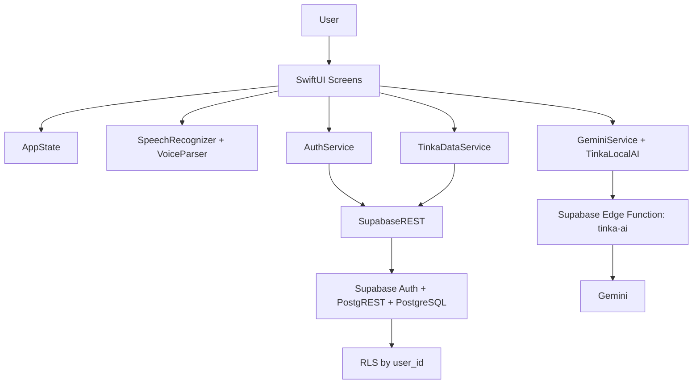

# Tinka

**Tinka** is an iOS SwiftUI application for small businesses that turns daily sales, product catalogs, voice commands, and business metrics into actionable financial insights.

The project was built for a hackathon/concurso context and focuses on a practical problem: helping micro and small merchants register sales quickly, understand their numbers, and receive intelligent recommendations without needing a complex point-of-sale system.

## Elevator Pitch

Tinka converts the voice of a small business into structured sales data, reports, and financial intelligence.

A seller can say:

```text
Vendí un pollo frito a doce bolivianos y una fanta a 5
```

Tinka can detect new products, add them to the catalog, prepare the sale, update analytics, and keep the data protected per user in Supabase.

## Key Features

- Supabase Auth login, registration, password recovery, and session handling through REST.
- User-specific business profile.
- Product catalog CRUD with aliases for voice recognition.
- Combo CRUD with product composition.
- Sales registration from manual input and voice.
- Voice parser for Spanish/Bolivian daily speech.
- New product learning from voice commands.
- Dashboard with daily sales, weekly sales, ticket average, top product, utility estimate, and Tinka Score.
- AI insights powered by Gemini through Supabase Edge Function.
- Local AI fallback when Gemini is unavailable.
- Reports with PDF export.
- Data isolation with Supabase RLS.
- App branding with Banco Fie/Tinka visual identity.

## Technical Stack

- **Platform:** iOS
- **UI:** SwiftUI
- **Language:** Swift
- **Project:** Xcode project
- **Backend:** Supabase REST
- **Auth:** Supabase Auth via REST endpoints
- **Database:** Supabase PostgreSQL
- **Security:** Row Level Security
- **Networking:** URLSession async/await
- **Voice:** Apple Speech Framework
- **AI:** Gemini via Supabase Edge Function
- **Fallback AI:** Local rule-based business intelligence engine
- **PDF:** UIGraphicsPDFRenderer
- **Persistence:** Supabase as source of truth, UserDefaults as lightweight local cache

## Architecture



## Main Modules

| Module | Responsibility |
|---|---|
| `RootView` | App entry state: splash, login, authenticated app, tab navigation |
| `TinkaTabBar` | Main navigation: Home, Sales, Voice, Catalog, Reports, Profile |
| `AuthService` | Login, signup, reset password, signup error handling, profile creation |
| `SupabaseREST` | Custom REST client for Auth and PostgREST, no Supabase Swift SDK |
| `TinkaDataService` | CRUD for products, combos, sales, chat, and business profile |
| `AppState` | Shared app state, computed analytics, and sync actions |
| `SpeechRecognizer` | Microphone + Apple Speech transcription |
| `VoiceParser` | Product matching, fuzzy matching, quantities, prices, new product detection |
| `GeminiService` | Remote AI call with local fallback |
| `ReportsView` | Analytics, report summaries, and PDF export |

## Voice Recognition Flow

Tinka does not send raw audio to an AI model. The voice flow is deterministic and explainable:

1. `SpeechRecognizer` uses Apple Speech Framework to transcribe microphone input.
2. `VoiceView` sends the transcript to `VoiceParser`.
3. `VoiceParser` normalizes the text by removing accents, punctuation, and extra spaces.
4. The parser checks product names, aliases, plurals, combos, and fuzzy matches.
5. If products are detected, the app shows a confirmation screen before saving the sale.
6. If a product is unknown but includes a price, Tinka proposes adding it to the catalog.

Supported examples:

```text
Vendí dos salteñas y un refresco
Vendí un combo almuerzo
Vendí un pollo frito a doce bolivianos
Vendí un pollo frito a doce pesos
Vendí una fanta a 5
Vendí un pollo frito a doce bolivianos y una fanta a 5
```

## Voice Catalog Learning

Tinka can learn products directly from a voice sale.

If the user says a product that is not in the catalog and includes a price, the app creates a `NewProductCandidate` with:

- product name,
- detected price,
- detected quantity.

When the user confirms **Agregar al catálogo**, Tinka:

- adds each new product to the current user's catalog,
- stores the detected price,
- supports Bolivian daily speech such as `pesos`, `bolivianos`, and `bs`,
- keeps already-known products in the same sale,
- prepares the full sale for final confirmation.

## AI Flow

Tinka uses AI for insights and recommendations, not for the critical sale parsing path.

### Remote AI

`GeminiService` calls a Supabase Edge Function:

```text
https://jhsnshxuxlnwkkbszcjx.supabase.co/functions/v1/tinka-ai
```

The request sends:

- user message,
- business context,
- Supabase session token when available,
- Supabase anon key as `apikey`.

### Local AI Fallback

If Gemini or the Edge Function is unavailable, `TinkaLocalAI` still generates useful responses from local business metrics:

- daily sales,
- weekly sales,
- top product,
- catalog state,
- combos,
- Tinka Score,
- ticket average,
- estimated utility.

This makes the app resilient during demos and in poor network conditions.

## Supabase Setup

### Hackathon Auth Configuration

For hackathon/demo runs, disable email confirmation so registration returns a session immediately and avoids confirmation email rate limits:

```text
Supabase Dashboard -> Authentication -> Providers -> Email -> disable Confirm Email
```

With Confirm Email disabled, Tinka signs the new user in, creates or updates `business_profiles`, and routes to the dashboard.

New users start with an empty catalog. Starter products are only loaded if the user taps **Cargar base** in Catálogo or Ajustes.

### RLS Data Isolation

Run this SQL script in Supabase Dashboard -> SQL Editor:

```text
supabase/rls_policies.sql
```

The script:

- enables RLS for all app tables,
- adds `user_id` ownership to `combo_items` and `sale_items`,
- creates select/insert/update/delete policies,
- ensures each authenticated user can only access their own rows.

Tables protected by RLS:

- `business_profiles`
- `products`
- `combos`
- `combo_items`
- `sales`
- `sale_items`
- `chat_messages`

## Data Model

| Table | Purpose |
|---|---|
| `business_profiles` | User's business profile |
| `products` | Product catalog |
| `combos` | Product bundles/promotions |
| `combo_items` | Products inside combos |
| `sales` | Sale header/summary |
| `sale_items` | Products inside a sale |
| `chat_messages` | AI/chat message history |

Every business data table is tied to the authenticated user through `user_id`.

## Demo Flow

Recommended demo sequence:

1. Open the app and show the branded splash.
2. Register or sign in with a Supabase user.
3. Complete or review the business profile.
4. Open Catálogo and create products, or use **Cargar base**.
5. Go to Voz.
6. Say: `Vendí un pollo frito a doce bolivianos y una fanta a 5`.
7. Confirm adding the new products.
8. Confirm the sale.
9. Return to Inicio and show dashboard metrics updating.
10. Open Reportes and export PDF.
11. Show AI insights based on business data.

## Build and Run

Open the Xcode project:

```text
design-zone.xcodeproj
```

Requirements:

- Xcode with an installed iOS Simulator runtime,
- iOS 17+ target,
- microphone permission,
- speech recognition permission,
- Supabase project configured,
- RLS SQL applied.

Run from Xcode on an iPhone Simulator or a physical iPhone.

## Validation Status

Validated locally:

- Swift typecheck passes.
- `git diff --check` passes.
- Supabase RLS SQL was created and applied during testing.
- Voice parser supports fuzzy matching, product aliases, prices, and multiple new products.
- New users no longer receive automatic starter catalog items.
- Product deletion cleans combo references.

Known environment note:

- CLI `xcodebuild` may fail if the machine does not have the required iOS Simulator runtime installed. In that case, run the project directly from Xcode with an available simulator.

## Hackathon Documentation

Full presentation documentation is available at:

```text
HACKATHON_DOCUMENTATION.md
```

## Pitch Line

**Tinka turns small-business voice input into structured sales data, secure analytics, and intelligent recommendations.**
